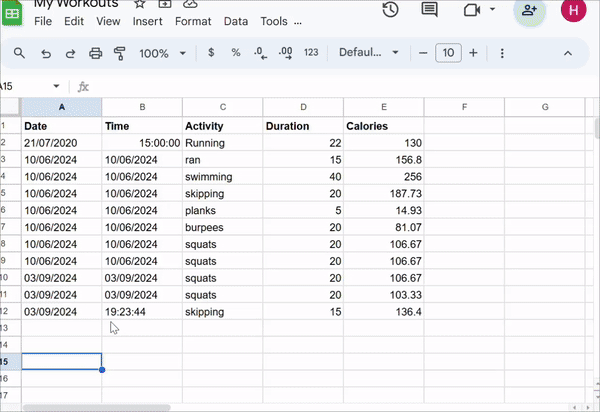

# Calorie Tracked GoogleSheets

## Overview

The **Calorie Tracked** is a web application that helps users track the calories they burn during exercises. Utilizing the Nutritionix and Sheety APIs, this app allows users to input their exercise details and personal parameters (like weight, height, and age). The application then calculates the calories burned based on the provided input and automatically logs the data into a Google Sheets spreadsheet for easy tracking and management.

## Features

- **Enter Exercise Details**: Users can input the type of exercise, weight, height, and age.
- **Calorie Calculation**: The app uses the Nutritionix API to calculate calories burned.
- **Automatic Data Logging**: The Sheety API uploads the exercise data to Google Sheets for easy access and tracking.

## APIs Used

### Nutritionix API

- **Purpose**: Calculates the number of calories burned based on exercise details.
- **Documentation**: [Nutritionix API Documentation](https://developer.nutritionix.com/docs/v2)

### Sheety API

- **Purpose**: Sends the calculated exercise data to a Google Sheets document.
- **Documentation**: [Sheety API Documentation](https://sheety.co/docs)

## Setup Instructions

1. **Create a Google Sheets Project**:
   - Go to [Google Sheets](https://sheets.google.com) and create a new spreadsheet.
   - Use Sheety to connect your Google Sheets to the application. Follow the instructions in the Sheety documentation to create a project and obtain your API endpoint.

2. **Obtain API Keys**:
   - **Nutritionix API**: Sign up for an API key from [Nutritionix](https://developer.nutritionix.com/).
   - **Sheety API**: Follow Sheety's documentation to get your API endpoint and credentials.

3. **Configure the Application**:
   - Update the `index.html` file with your API keys and endpoint details.
   - Set up the Sheety API endpoint in the `index.html` to point to your Google Sheets project.

4. **Run the Application**:
   - Ensure you have Flask installed. You can install it using `pip install Flask`.
   - Start the Flask server by running `python app.py`.
   - Open your web browser and navigate to `http://localhost:5000` to access the application.

## About Flask

Flask is a lightweight web framework used to create the application's GUI. It handles user input, processes API requests, and integrates with the Nutritionix and Sheety APIs.

## How It Works

- **User Input**: Users provide exercise details and personal parameters through a web form.
- **API Requests**: The application sends the data to the Nutritionix API for calorie calculation.
- **Data Storage**: The calorie data is then sent to Google Sheets using the Sheety API for tracking and analysis.

